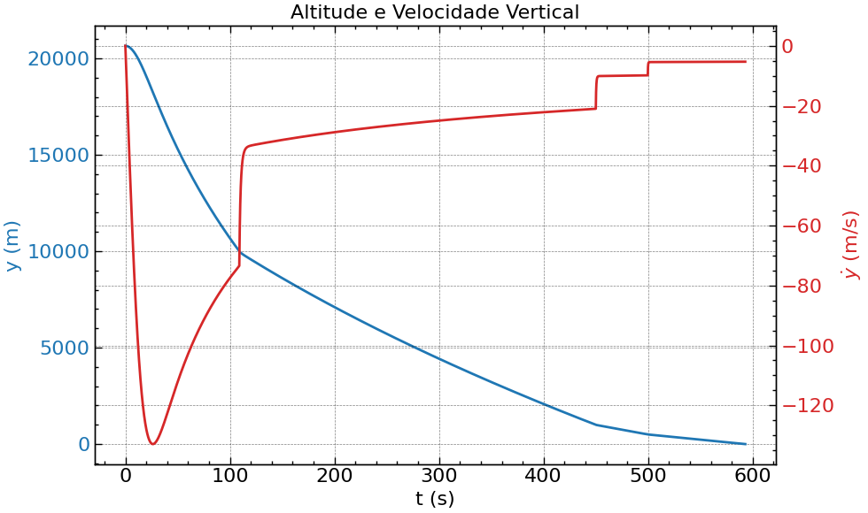

# Relatório da Simulação de Queda de Paraquedas

## Parâmetros da Simulação
- **Massa total**: 5.00 kg
- **Apogeu inicial**: 20650.00 m
- **Altura abertura drogue**: 10000.00 m
- **Altura abertura reefing**: 1000.00 m
- **Altura abertura main**: 500.00 m

## Resultados Principais
- **Tempo total de queda**: 592.88 s
- **Altitude máxima alcançada**: 20650.00 m
- **Velocidade máxima**: 132.94 m/s
- **Deslocamento horizontal**: 2059.64 m

### Velocidade de Impacto
- **Magnitude**: 6.41 m/s
- **Componente vertical**: -5.29 m/s
- **Componente horizontal**: 3.61 m/s
- **Direção**: -55.7° da horizontal

## Eventos de Abertura
- Abertura Drogue: 108.97s (vy = -73.51 m/s)
- Abertura Reefing: 449.95s (vy = -21.02 m/s)
- Abertura Main: 499.66s (vy = -9.85 m/s)

## Visualizações

### Trajetória Completa

### Altitude e Velocidade Vertical

### Componentes de Velocidade

### Velocidade Escalar

